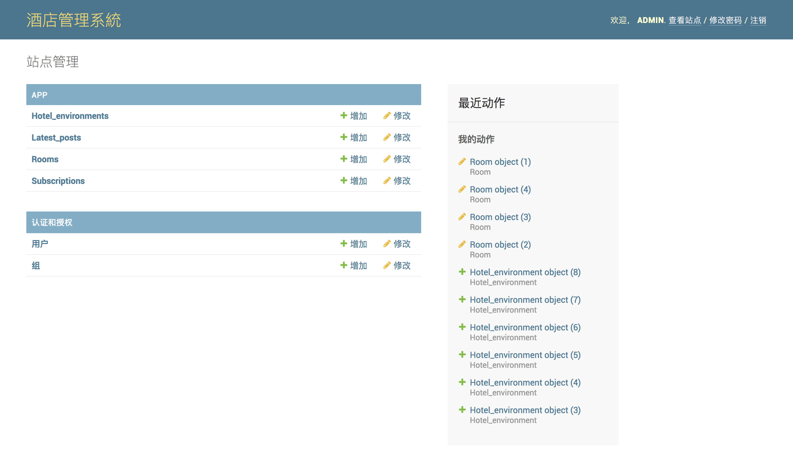
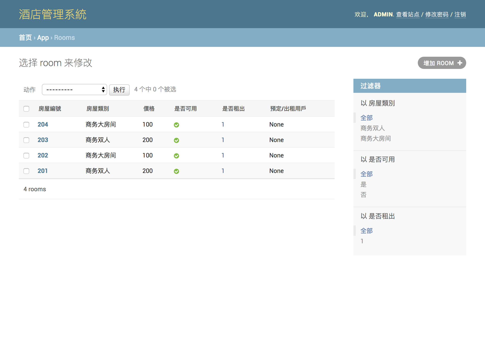

# Linux task 項目說明
##### 這是一個簡單的基於Python3 Django的酒店預定系統，現已初步完成系統原型。

English version: (click here) [./README.md]

### 項目依賴庫
見 requirements.txt 文件

使用方法: 在命令行中输入 ```pip3 -r install requirements.txt```

### 管理員長號密碼

> 用戶名 admin
> 密碼 1qazxsw2

### 項目聲明

1. 本項目僅供作業開發使用，嚴禁未修改直接使用於生產環境。所產生的所有後果，均由使用者承擔。
2. 本項目前端樣板由 [模板之家](http://www.mycodes.net/) 提供。
3. 項目存在已知Bug[[注]]()，並未完全修正。 如果您發現更多的Bug或有Bug的修正方案，我們將很高興的接納您的方案。


### 項目頁面基礎展示

[注]：樣例中的所有圖片及數據均源自樣板及互聯網








#### [注]已知Bug列表

> - 用户注册后无法注销或切换用户
> - ~~用戶介面無法正常跳轉~~
> - ~~圖片展示頁面，圖片無法正常預覽~~
> - 後台展示頁面存在未知異常(小概率)
> - 用戶註冊頁面無法無異常參數處理
> - 郵箱提交接口無郵箱驗證方案
> - ~~未啟用自定義Admin後台~~ (暫時未使用)


項目參與協作：孙楠，曹國鴻(土豆豆)