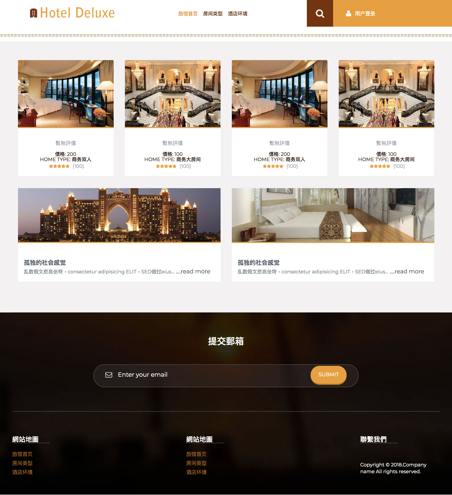
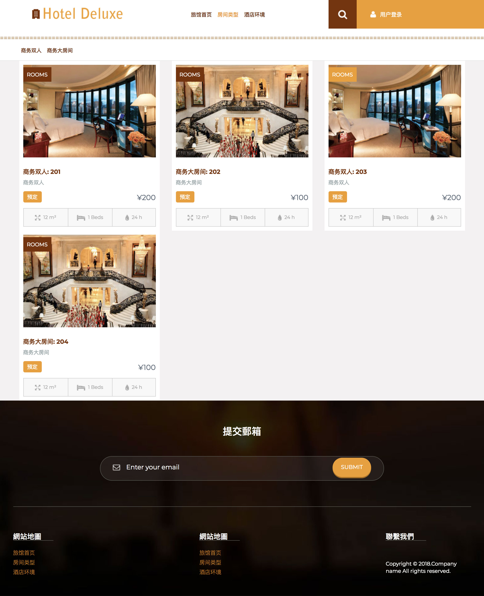
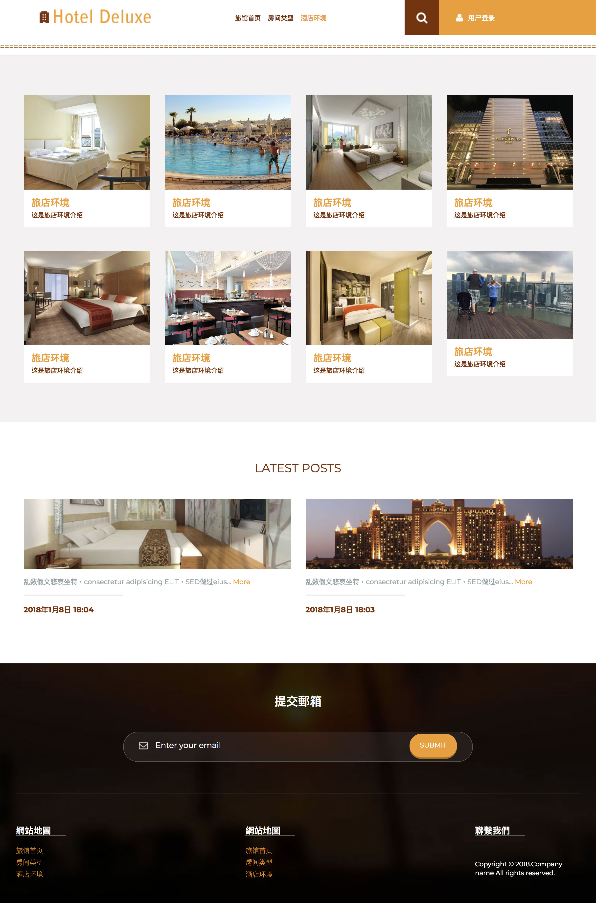
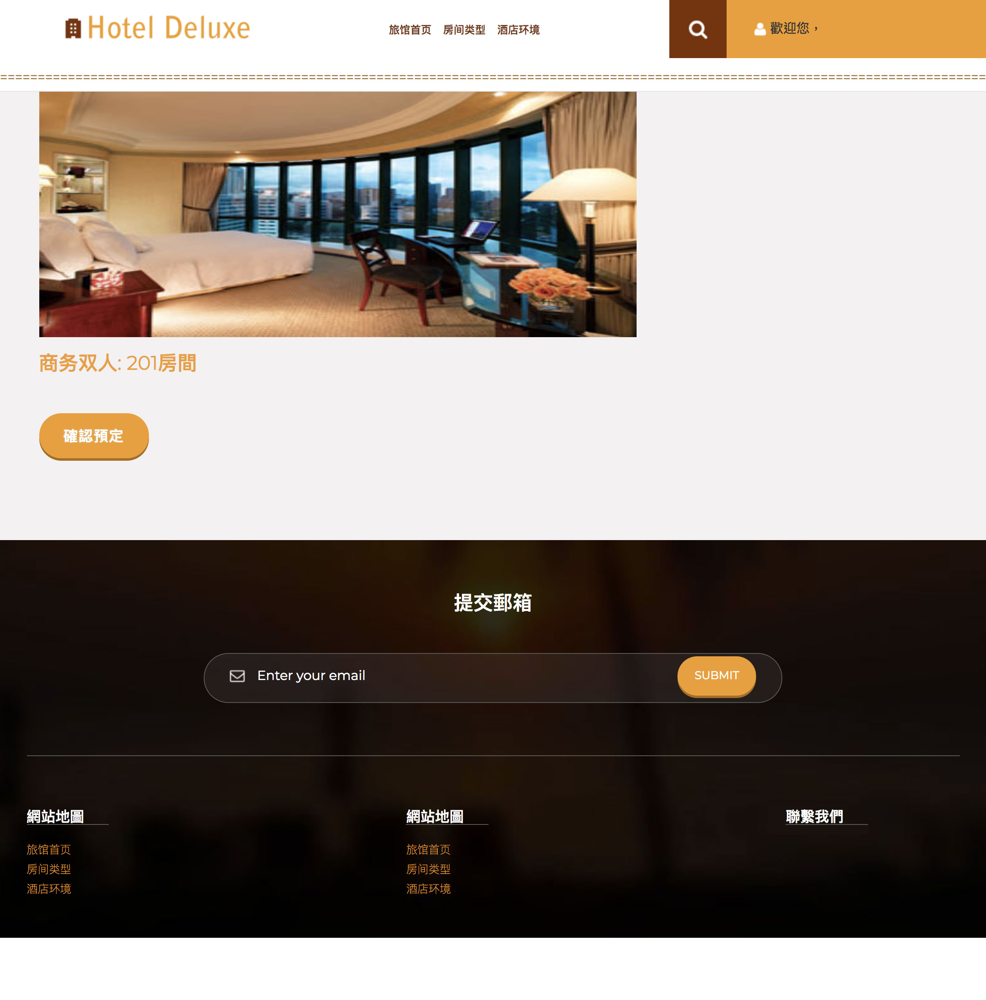
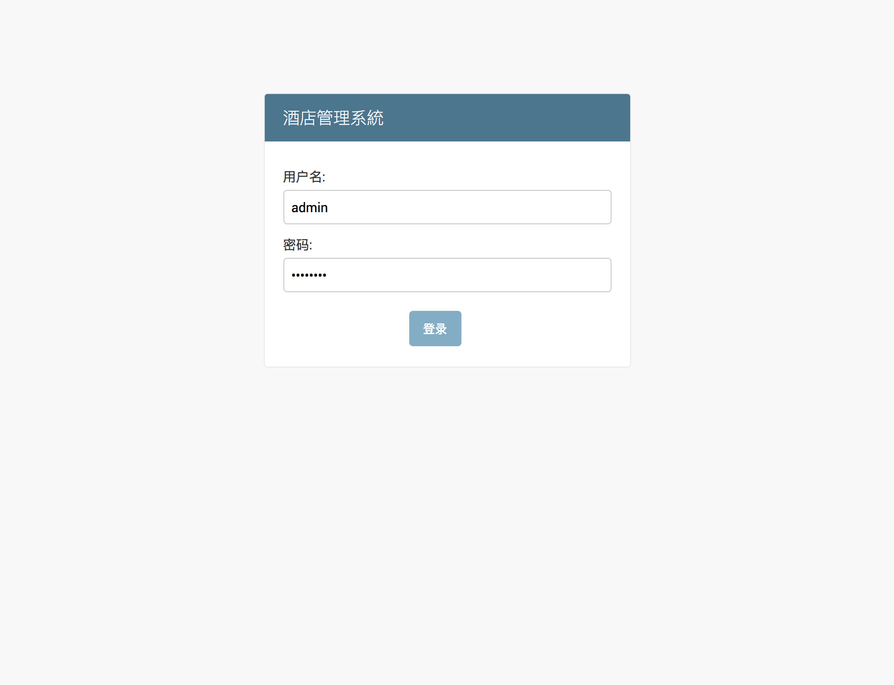
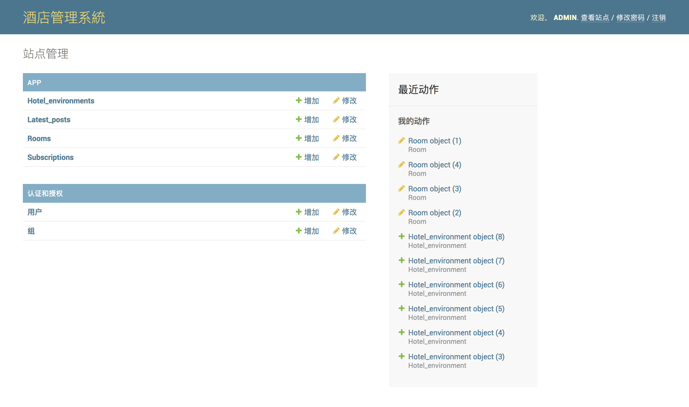
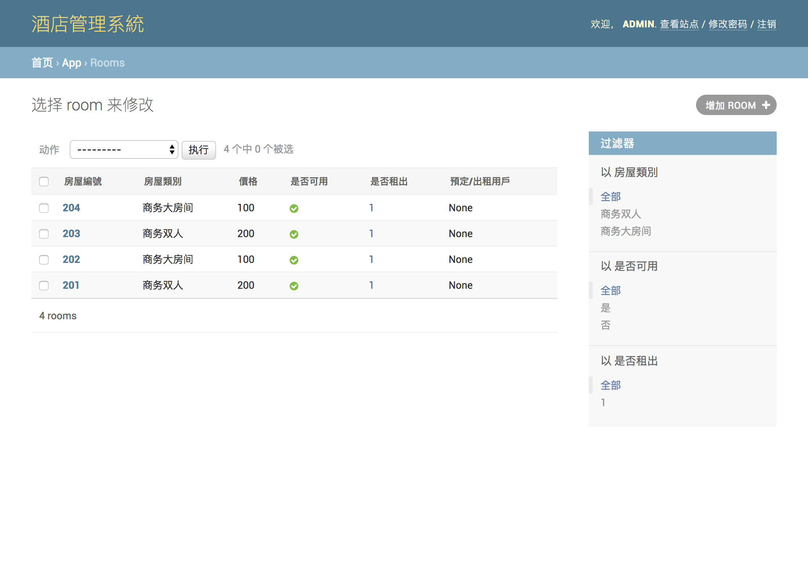

# Linux Task Project Description
##### This is a simple hotel reservation system based on Python3 Django, which is now a prototype of the system.

中文說明(正體中文)：(點擊這裡)[./README-zh.md] 

### Project Dependencies Library
See Requirements.txt file

How to use ： Enter at command line ```pip3 -r install requirements.txt```

### Administrator trombone Password

> Username Admin
> Password 1QAZXSW2

### Project Statement

1. This project is only for the development and use of operations, is strictly prohibited without modification directly to the production environment. All the consequences are borne by the user.
2. The front end model of this project is provided by [模板之家] (http://www.mycodes.net/).
3. There are known bugs in the project and have not been fully amended. If you find more bugs or bug fixes, we will gladly accept your proposal.


### Project Page Foundation Show

[Note]: All the pictures and data in the sample are from the model and the Internet























#### [note] List of known bugs

> - Users cannot log off or switch users after registration
> - The user interface does not jump properly
> - Picture Display page, the picture is not normal preview
> - Background Display page with unknown exception (small probability)
> - User Registration Page cannot be handled without exception parameters
> - Mailbox Submission Interface no mailbox verification scheme
> - Custom admin background not enabled (temporarily unused)


Project participation in collaboration: 孙楠，曹國鴻(土豆豆)
